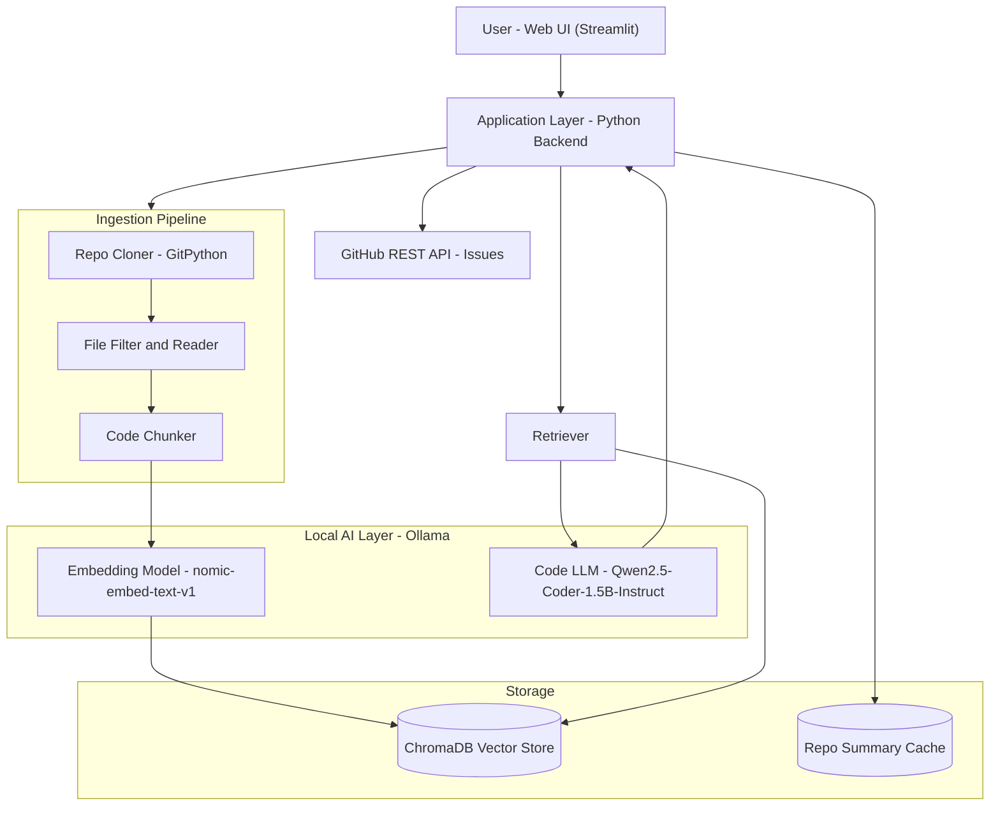
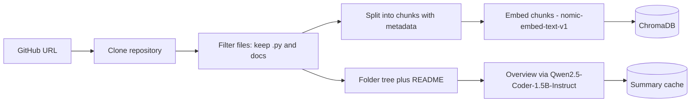
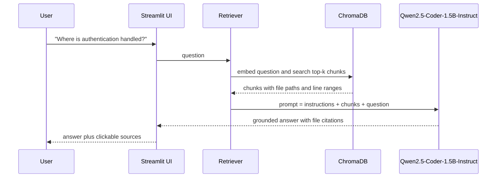
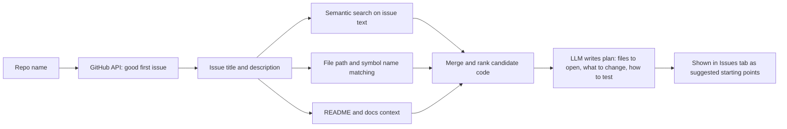
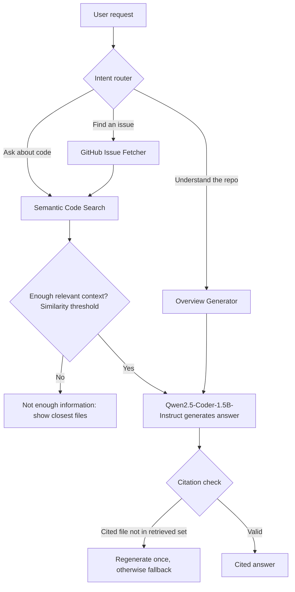

# 1. Project Name

# RepoEase
### Your local AI guide to unfamiliar open-source Python codebases

> Hacktober Fest | Open Source AI Hackathon | Qualifier Submission
> Team: `CodeX` | Members: `Neeraj Watkar`, `Meet Rajbhoj`, `Jidnyasa Bhoyar`

---

## Table of Contents
1. [Project Name](#1-project-name)
2. [Problem Statement](#2-problem-statement)
3. [Project Overview](#3-project-overview)
4. [Proposed Solution](#4-proposed-solution)
5. [Objectives](#5-objectives)
6. [Target Users / Use Case](#6-target-users--use-case)
7. [Open-Source AI Technology Selected](#7-open-source-ai-technology-selected)
8. [Why This Technology Was Selected](#8-why-this-technology-was-selected)
9. [AI's Role in the System](#9-ais-role-in-the-system)
10. [System Architecture](#10-system-architecture)
11. [Component-Level Architecture](#11-component-level-architecture)
12. [Data / Information Flow](#12-data--information-flow)
13. [Agentic Workflow](#13-agentic-workflow)
14. [Technology Stack](#14-technology-stack)
15. [Expected Features](#15-expected-features)
16. [Implementation Approach](#16-implementation-approach)
17. [Expected Final Output](#17-expected-final-output)
18. [Future Scope / Scalability](#18-future-scope--scalability)
19. [Open-Source Dependencies / Components](#19-open-source-dependencies--components)
20. [Expected Challenges and Mitigation](#20-expected-challenges-and-mitigation)

---

# 2. Problem Statement

Contributing to open source is hard to start. A first-time contributor who opens an unfamiliar repository faces:

- **No map.** Hundreds of files and folders, and no clear idea which ones matter.
- **Slow orientation.** Reading a codebase well enough to make a first change often takes days.
- **Hard issue selection.** Issue lists are long, and it is difficult to tell which issues are beginner-friendly and where in the code they live.
- **Privacy limits.** Students and developers working on private or company code cannot paste it into a cloud AI tool.

Many beginners give up before their first contribution. This is especially painful during events like Hacktoberfest, when thousands of newcomers try to contribute at once.

---

# 3. Project Overview

**RepoEase** is a locally running, tool-using AI agent that helps new contributors understand unfamiliar Python repositories quickly. The user gives it a GitHub repository URL. RepoGuide downloads the repository, builds a searchable semantic index of the code, and then offers three things:

1. A plain-language **overview** of what the project does and how its folders are organized.
2. A **question-answering chat** over the code, where every answer cites the exact files it came from.
3. A **starter-issue guide** that finds beginner-friendly GitHub issues and explains, step by step, where to look in the code to fix them.

RepoEase uses open-source software and open-weight models with permissive licenses, and all of them run on the user's own machine. AI inference and the indexed source code stay local; the only network calls are to GitHub to fetch a repository and its issues.

**Supported scope:** Python repositories up to a size limit (default: a few hundred files). For larger repositories, RepoGuide indexes the most relevant folders and tells the user clearly what was skipped.

---

# 4. Proposed Solution

RepoGuide uses **Retrieval-Augmented Generation (RAG)** over source code, combined with live data from the GitHub API.

1. **Ingest:** clone the repository and collect source files, the README and documentation.
2. **Chunk and embed:** split files into small overlapping chunks and convert each into a vector with an open-source embedding model.
3. **Store:** save the vectors and file metadata in a local vector database.
4. **Retrieve:** for any question, find the most relevant chunks.
5. **Generate:** give those chunks to a small local open-weight LLM, which writes a grounded answer and cites file paths.
6. **Issues:** fetch "good first issue" items from GitHub, retrieve the code related to each one, and have the LLM produce a short, beginner-friendly action plan.

The LLM is instructed to answer only from retrieved code, and a set of grounding checks (see Section 13) reduces hallucination. The user can always verify an answer through its cited source.

---

# 5. Objectives

- Cut the time to understand an unfamiliar Python repository from days to minutes.
- Give every answer a verifiable source (file path and line range).
- Help newcomers find a suitable first issue and know where to start.
- Run entirely on local, open-source components with no paid AI APIs and no source code sent to a cloud AI service.
- Keep the design simple and modular so it can be implemented fully within the final hackathon.

---

# 6. Target Users / Use Case

| User | Need | How RepoEase helps |
|---|---|---|
| First-time open-source contributors (students) | Find a starting point in a large repo | Overview plus starter issues with a plan |
| Hacktoberfest participants | Pick and fix an issue fast | Issue-to-code mapping |
| Developers joining a new team | Understand an unfamiliar codebase | Local Q&A with file citations (private repos: future scope) |
| Maintainers | Reduce repeated "where is X?" questions | Share RepoEase as an onboarding aid |

**Example use case:**
A student pastes the URL of a small open-source Python project. RepoEase shows a summary, the student asks "Where is the configuration loaded?", gets an answer citing `config/loader.py`, then opens the starter-issues tab and picks an issue with a suggested plan.

---

# 7. Open-Source AI Technology Selected

| Component | Selected technology | Type |
|---|---|---|
| Language model | **Qwen2.5-Coder-1.5B-Instruct** (quantized) | Open-weight code LLM |
| Embedding model | **nomic-embed-text-v1** | Open-weight embedding model |
| Model runtime | **Ollama** (built on llama.cpp) | Open-source inference framework |
| Vector database | **ChromaDB** | Open-source vector database |
| RAG pipeline | Custom lightweight pipeline in Python (optional LangChain text splitters) | Open-source RAG tooling |

---

# 8. Why This Technology Was Selected

The choices are driven by the problem, not by popularity.

| Choice | Why it fits this problem |
|---|---|
| **Qwen2.5-Coder-1.5B-Instruct** | Trained specifically on code, so it understands programming-language structure better than a general model of the same size. It is small enough to run on a student laptop. Its open weights allow fully local use. |
| **nomic-embed-text-v1** | A well-regarded open embedding model that handles code and text, runs locally through Ollama, and needs no separate setup. |
| **Ollama** | Installs with one command, serves models locally through a simple API, and handles quantization, which makes it practical for a team new to LLMs. |
| **ChromaDB** | Embedded, needs no server, stores data on disk, and supports metadata filtering (file path, language). This keeps setup quick. |
| **Plain-Python pipeline** | A small, readable pipeline lets the whole team understand every step. It avoids heavy frameworks the team would need time to learn. |

**Why open source suits this project:**
- **Privacy:** AI inference and indexed code stay on the user's machine. Private repository support through authenticated GitHub access is planned as future scope.
- **Cost:** no per-query fees, so anyone can use it.
- **Offline use:** local AI inference keeps working without internet once the models and the repository are available locally. GitHub access is still required to fetch or update repositories and issues.
- **Transparency:** users and judges can inspect every component.

---

# 9. AI's Role in the System

AI is essential to the core value of the product, not an add-on.

| AI component | Role | What breaks without it |
|---|---|---|
| Embedding model | Turns code and questions into vectors so search is based on meaning, not just keywords | Searching for "where is login handled?" would miss files that never use the word "login" |
| Code LLM | Summarizes modules, answers questions using retrieved code, and writes issue plans | The user would get raw search results with no explanation |
| Retrieval layer | Grounds the LLM in the actual repository and supplies the citations | The LLM would guess and hallucinate |

Non-AI components (the GitHub API, cloning, filtering, the UI) provide the data and the interface around the AI.

---

# 10. System Architecture

The system has four layers: a **UI layer**, an **application layer** that coordinates everything, a **local AI layer** (models served by Ollama), and a **storage layer** (vector database and cache). The only external call is to the public GitHub API, to download a repository and read issues.

---

# 11. Component-Level Architecture

| # | Component | Responsibility | Input | Output |
|---|---|---|---|---|
| 1 | **Repo Cloner** | Downloads the repository to a local folder | GitHub URL | Local repo directory |
| 2 | **File Filter and Reader** | Keeps `.py` files, README and docs; skips tests, `venv`, binaries and very large files | Repo directory | List of file paths and text |
| 3 | **Code Chunker** | Splits each file into overlapping chunks (about 40 to 60 lines) and attaches metadata (file path, start line, end line) so citations can be validated | File text | Chunks with file path and line range |
| 4 | **Embedding Service** | Converts each chunk into a vector | Chunk text | Embedding vector |
| 5 | **Vector Store (ChromaDB)** | Stores vectors and metadata, and runs similarity search | Vectors, query vector | Top-k relevant chunks |
| 6 | **Retriever** | Embeds the user question and fetches the most relevant chunks | Question | Ranked chunks with sources |
| 7 | **Prompt Builder** | Assembles instructions, retrieved chunks and the question into a prompt that forces grounded, cited answers | Chunks, question | Final prompt |
| 8 | **LLM Service** | Generates the answer with the local model | Prompt | Answer text |
| 9 | **Overview Generator** | Builds a repo summary from the folder tree, README and key files | Repo data | Overview text |
| 10 | **Issue Fetcher** | Pulls open issues labelled "good first issue" from GitHub | Repo name | Issue list |
| 11 | **Issue Planner** | Retrieves code related to an issue and generates a short fix plan | Issue text | Step-by-step plan |
| 12 | **UI (Streamlit)** | Displays the overview, chat and issues tabs | User actions | Rendered results |

---

# 12. Data / Information Flow

### A. Indexing flow (happens once per repository)

### B. Question-answering flow

### C. Starter-issue flow

**Data summary**

| Data | Where it lives | Leaves the machine? |
|---|---|---|
| Source code and chunks | Local disk and ChromaDB | No |
| Embeddings | Local ChromaDB | No |
| Questions and answers | Local session | No |
| Issue metadata | Fetched from public GitHub API | Only the repo name is sent |

---

# 13. Agentic Workflow

RepoGuide is a **tool-using AI agent with a controlled workflow**, not a fully autonomous agent. A router decides which tool to run for each request, the tools gather evidence from the repository, and the LLM composes an answer that must pass grounding checks before it is shown.

**Intent router:** simple keyword rules handle clear requests, and the local LLM classifies ambiguous ones into one of three labels (overview, code question, find issue).

**Tools available to the agent**

| Tool | Purpose |
|---|---|
| `search_code(query)` | Semantic search over the indexed chunks |
| `read_file(path)` | Return the full text of a file for deeper context |
| `list_structure()` | Return the repo folder tree |
| `fetch_issues(repo)` | Retrieve starter issues from GitHub |

**Hallucination guardrails (a core design feature)**

1. **Similarity threshold:** if the retrieved chunks are not relevant enough, the LLM is never called, and the user sees "I don't have enough information" plus the closest files.
2. **Constrained prompt:** the model is told to use only the supplied code and to cite file paths and line ranges.
3. **Citation validation:** every file path and line range in the answer is checked against the chunks that were actually retrieved. Invalid citations trigger one regeneration, then a fallback.
4. **Visible sources:** every answer shows its sources so the user can verify it.

These checks reduce hallucination but cannot eliminate it, so the interface always presents answers together with their sources.

---

# 14. Technology Stack

| Layer | Technology | Purpose |
|---|---|---|
| Language | Python 3.10+ | Entire backend |
| LLM runtime | Ollama | Serves models locally |
| LLM | Qwen2.5-Coder-1.5B-Instruct (quantized) | Explanations, answers, plans |
| Embeddings | nomic-embed-text-v1 | Semantic vectors |
| Vector DB | ChromaDB | Similarity search and metadata |
| Repo access | GitPython | Clone repositories |
| Issues | GitHub REST API (requests) | Starter issues |
| Chunking | Custom splitter (optionally LangChain text splitters) | Break code into chunks |
| Frontend | Streamlit | Interactive web UI |
| Diagrams | Mermaid | Architecture rendering |
| Version control | Git and GitHub | Team collaboration |

---

# 15. Expected Features

**Core (must-have for the final)**
- Paste a GitHub URL and index a Python repository.
- Auto-generated **repo overview**: purpose, folder structure, key files.
- **Chat with the codebase**, with answers citing file paths and line ranges.
- **Starter issues** tab: good-first-issue list with an AI-generated plan for each.
- Runs fully locally with open-weight/open-source models.

**Should-have**
- Index caching, so a repo is not re-processed every time.
- Progress bar during indexing.
- Clear "I'm not sure" fallback when retrieval confidence is low.

**Nice-to-have (only if time allows)**
- Auto-generated Mermaid folder diagram.
- Support for a second language (JavaScript).
- Download the overview as a Markdown file.

---

# 16. Implementation Approach

The work is split across three team members and one hackathon day, with the smallest working version built first.

### Team roles

| Member | Focus | Owns |
|---|---|---|
| Neeraj Watkar | Ingestion and GitHub data | Cloning, file filtering, chunking with line numbers, GitHub issue fetcher |
| Meet Rajbhoj | AI and retrieval | Ollama setup, embeddings, ChromaDB, retriever, similarity threshold, citation validation |
| Jidnyasa Bhoyar | Prompts, UI and integration | Prompt builder, overview generator, issue planner, Streamlit UI, testing, demo prep |

Each member owns one part of the pipeline, and all three pair up during integration so everyone can explain the full system.

### Build plan

| Phase | Goal | Done when |
|---|---|---|
| 0. Setup (before the final) | Install Ollama, pull both models, confirm a test prompt works | Model replies locally |
| 1. Foundations | Clone a repo, filter files, create chunks | Chunks printed with file paths |
| 2. Indexing | Embed chunks and store in ChromaDB | A search returns relevant chunks |
| 3. Q&A | Retriever plus LLM produce cited answers | Questions answered correctly on a demo repo |
| 4. Overview and issues | Overview generator and issue planner | Both tabs produce output |
| 5. UI | Streamlit app connects all features | Full flow works end to end |
| 6. Polish | Caching, error handling, demo rehearsal | Smooth 3-minute demo |

### Scope control
- Python repositories only.
- Two or three small demo repositories, pre-indexed and cached.
- Plain Python functions instead of a heavy orchestration framework.
- If a feature is at risk, it moves to Future Scope.
- **Priority order:** (1) repository indexing, (2) semantic search, (3) Q&A with citations and grounding checks, (4) repository overview, (5) starter-issue plans, (6) extras. Q&A with citations is the core product and is protected first.

---

# 17. Expected Final Output

A working web application that:

1. Accepts a GitHub repository URL.
2. Indexes the repository locally and shows progress.
3. Displays a readable **overview** of the project.
4. Provides a **chat interface** where each answer lists its source files.
5. Lists **beginner-friendly issues** with a short plan for each.

**Demo plan:** run RepoGuide on a small public Python repository, ask two or three questions live, then open the starter-issues tab and walk through one issue plan.

---

# 18. Future Scope / Scalability

| Area | Future improvement |
|---|---|
| Understanding | Add a dependency and call graph to rank the most important files |
| Languages | Support JavaScript, TypeScript, Java and more using tree-sitter parsing |
| Scale | Hierarchical summaries (file, then module, then repo) for very large repositories |
| Agents | Specialized agents (Explorer, Explainer, Issue-Finder) with LLM-driven tool calling |
| Visuals | Auto-generated architecture and dependency diagrams |
| Integration | VS Code extension and a GitHub bot that comments a guide on new issues |
| Private repos | Authenticated GitHub access so users can index private repositories locally |
| Deployment | Docker image and a shared team server for company-wide onboarding |
| Quality | Larger or fine-tuned code models and re-ranking for better retrieval |
| Freshness | Incremental re-indexing when the repository changes |

---

# 19. Open-Source Dependencies / Components

| Component | Role | License type |
|---|---|---|
| Qwen2.5-Coder-1.5B-Instruct | Code LLM | Apache 2.0 |
| nomic-embed-text-v1 | Embeddings | Apache 2.0 |
| Ollama | Local model runtime | MIT |
| llama.cpp (via Ollama) | Efficient CPU/GPU inference | MIT |
| ChromaDB | Vector database | Apache 2.0 |
| GitPython | Git operations | BSD |
| Requests | HTTP and GitHub API calls | Apache 2.0 |
| Streamlit | Web UI | Apache 2.0 |
| LangChain text splitters (optional) | Chunking helpers | MIT |
| Mermaid | Diagram rendering | MIT |

*Model licenses are those listed on each model's Hugging Face page for the exact variants named above. Other model sizes may carry different licenses, so the team uses only the variants listed here.*

---

# 20. Expected Challenges and Mitigation

| # | Challenge | Mitigation |
|---|---|---|
| 1 | **Small model may give weaker answers** than large cloud models | Use retrieval to supply the exact code, write strict prompts, and keep questions focused on retrieved context |
| 2 | **Hallucinated answers** | Force citations, answer only from retrieved chunks, and show a "not sure" fallback when retrieval is weak |
| 3 | **Large repositories** (for example 500,000 lines) are slow to index and exceed the context window | Set explicit size limits, index the most relevant folders first, batch the work, retrieve only top-k chunks, tell the user what was skipped, and use pre-indexed demo repos. Full large-repo support is Future Scope (hierarchical summaries) |
| 4 | **Slow generation on laptops without a GPU** | Use quantized small models, cache results, keep answers short, and run the demo on the strongest available local machine |
| 5 | **Poor chunking splits functions in half** | Use overlapping chunks and split on function and class boundaries (`def`, `class`) where possible |
| 6 | **GitHub API rate limits** | Use an optional access token and cache issue results |
| 7 | **Team is new to LLM tooling** | Use simple tools (Ollama, Chroma, Streamlit), set up and test the environment before the final, and keep the architecture to plain Python functions |
| 8 | **Issue-to-code matching is imperfect** | Combine semantic search with file path, symbol and docs matching, and present results as suggested starting points rather than guaranteed answers |
| 9 | **Running out of time in the final** | Build the smallest end-to-end flow first, and treat extra features as optional |

---

*This repository intentionally contains only `README.md`, as required by the qualifier rules. Implementation will be built during the Final Hackathon.*
